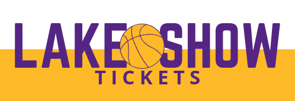
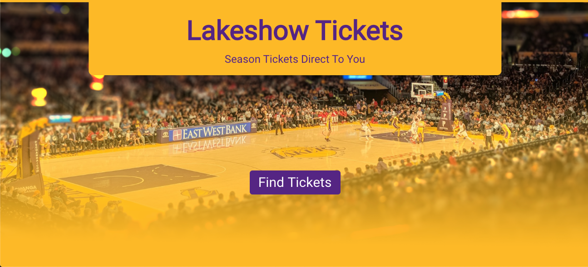
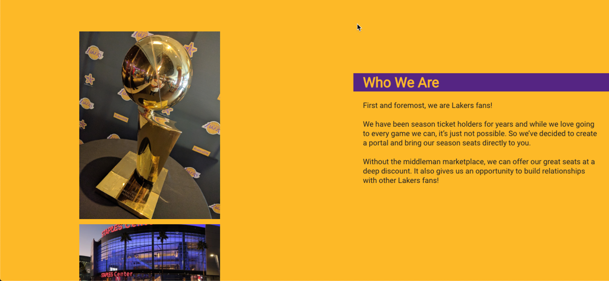
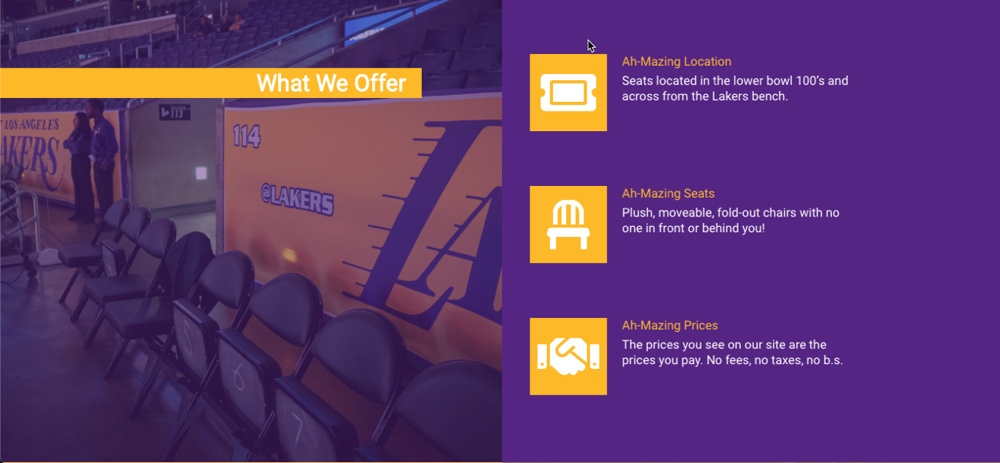
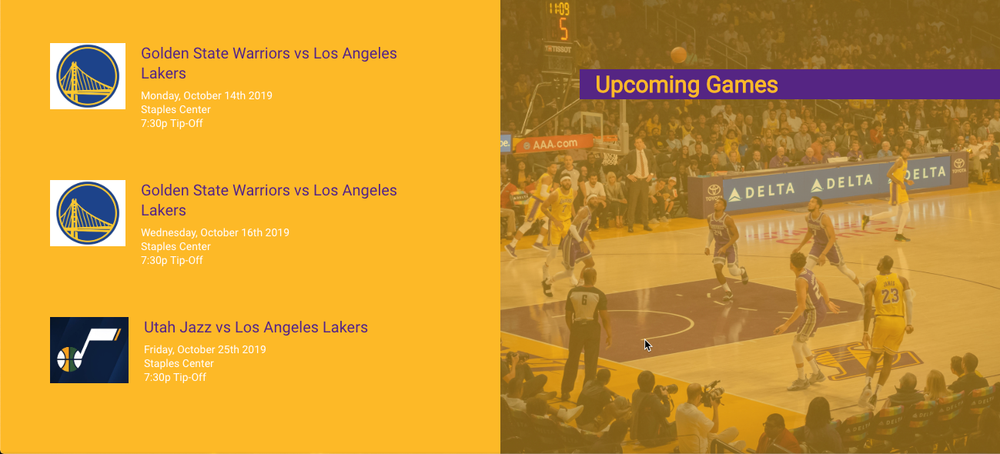
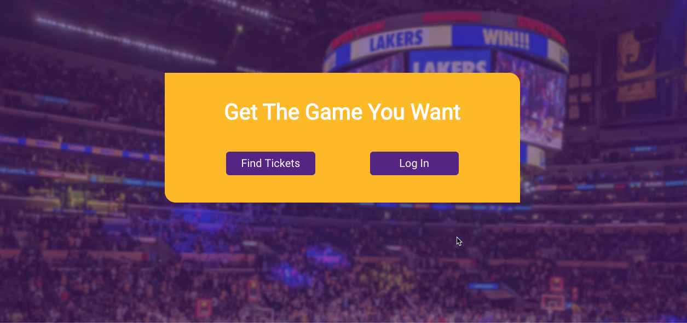
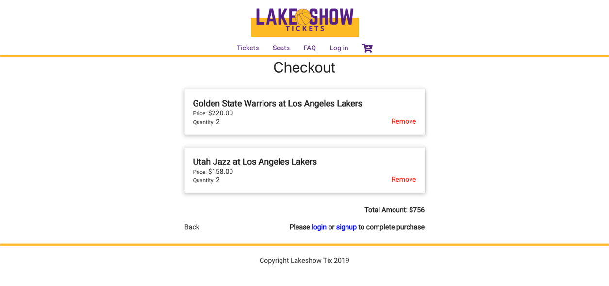
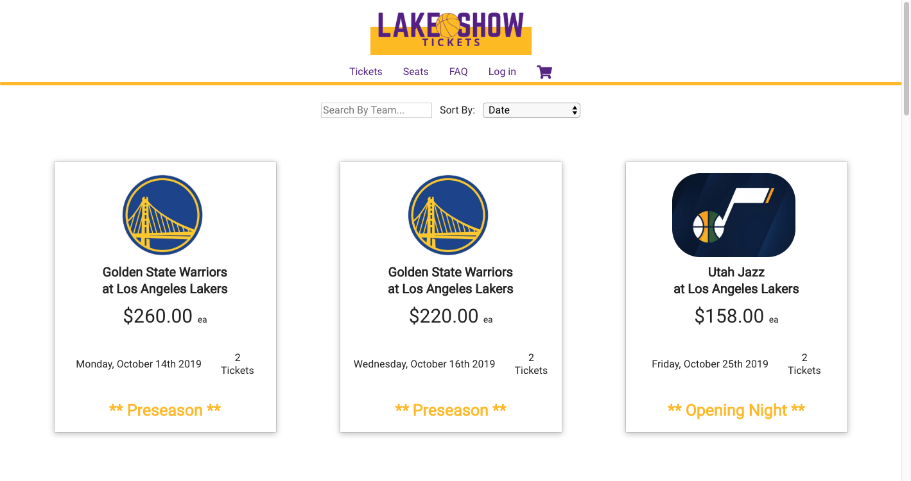
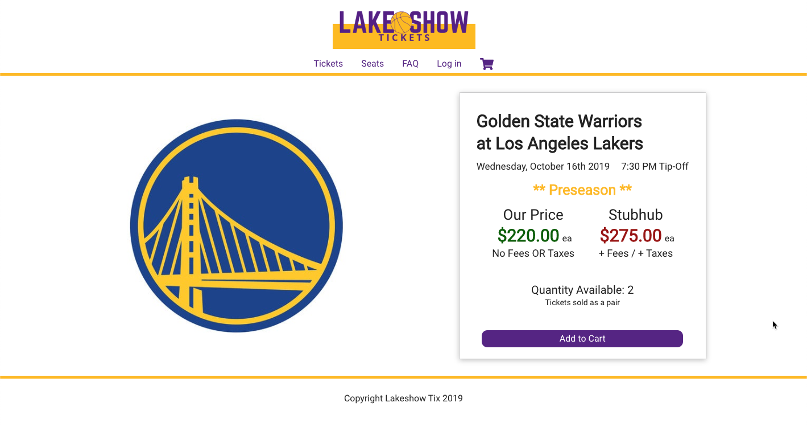

  

  Backend API for Lakeshow Tix.

<!-- START doctoc generated TOC please keep comment here to allow auto update -->
<!-- DON'T EDIT THIS SECTION, INSTEAD RE-RUN doctoc TO UPDATE -->
## Table of Contents

- [Introduction](#introduction)
- [Links](#links)
- [API Docs](#api-docs)
- [App Screenshots](#app-screenshots)
- [Feedback](#feedback)
- [Build Process](#build-process)
- [Scripts](#scripts)
- [Technology](#technology)

<!-- END doctoc generated TOC please keep comment here to allow auto update -->

## Introduction

With the rise of ticket fees for both sellers and buyers in the secondary marketplace for event tickets, this app was designed to connect Laker fans with Laker season ticket holders directly. Cutting out the middle man marketplace, by not charging buyers or sellers fees, the ticket prices are inherintely lower then any other other site the buyer chooses to post their tickets.

## Links

#### Live App: https://lakeshowtix.now.sh/

Client Github Repo: https://github.com/matrayu/lakeshow-app

Server Github Repo: https://github.com/matrayu/lakeshow-server

## API Docs

The RESTful API serving 7 endpoints:

* A POST request to api/auth/login to validate user and log them in
* A POST request to api/auth/refresh to refresh JWT 
* A GET request to api/auth/:user_id to retreive the users name and email for processing checkout 
* A POST request to api/users to send info to database and register user
* A GET request to api/tickets to get all available tickets in inventory
* A GET request to api/tickets/:ticket_id to get specific ticket data
* A POST request to api/auth/pay to capture ticket sales information and update ticket inventory

## App Screenshots

  
  
  
  
  
  
  
  

## Feedback

Feel free to send us feedback or [file an issue](https://github.com/matrayu/lakeshow-app/issues/new). Feature requests are always welcome. 

## Build Process

- Clone or download the repo
- `npm install` to install dependencies
- `npm start` to start the server and client

Then visit http://localhost:8000

## Scripts

- `npm run dev` to start nodemon
- `npm t` to run tests
- `ndb start` to run debugging experience

## Technology

- Node
- Express
- Knex
- Chai
- Mocha
- Supertest
- Cors
- Bcryptjs
- Helmet
